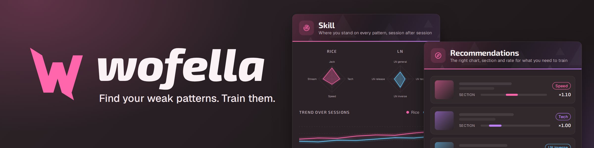

# wofella



[English](#english) · [Español](#español)

## English

wofella is a training companion for **osu!mania stable**, starting with 7K (rice and LN). It reads your osu! folder, indexes your charts and runs a pattern detector over them. This first beta is about labelling patterns. The **Label** screen plays chart sections on a playfield drawn with your own osu! skin, at your scroll speed and with the song's audio, so you can name the pattern you see. 7K maps you play in osu! while wofella is open show up in **Label → Progress**, as long as wofella has indexed the chart and you played under a name marked as yours. There you can tag each map's dominant pattern and see your labelling stats. **Export labels**, on the Label screen, saves the pattern windows you labelled there to a file you can share. The dominant-pattern tags from Progress are not exported yet.

What is **not** there yet: **Skill** (per-pattern skill tracking and session reports) and **Recommended** (chart, section and rate picks, plus practice drills) are "Coming soon" pages that show what they will do. The Ranking card on the Progress page is a placeholder too. Nothing is uploaded: your labels stay on your computer until you export them.

### Screenshots

<!-- screenshot: Label screen -->
<!--  -->

<!-- screenshot: Label → Progress -->
<!--  -->

<!-- screenshot: Identity ("Which of these are you?") -->
<!--  -->

<!-- screenshot: Home -->
<!--  -->

### Download (Windows 10/11)

Get `v0.1.0-beta.1` from [Releases](https://github.com/TWulfZ/wolluf/releases):

- `wofella-v0.1.0-beta.1-portable.exe` runs without installing. It needs Microsoft Edge WebView2, which Windows 11 already has; if the portable exe opens no window, use the installer, which sets WebView2 up. To update, download a newer one; your data stays where it is.
- `wofella-v0.1.0-beta.1-setup.exe` is the installer.

If you installed an earlier build, it was named wolluf. The beta installs separately; uninstall 'wolluf' from Apps and leave 'Delete the application data' unticked, or your interface preferences are reset. Your labels and plays in `%LOCALAPPDATA%\wolluf\data` are kept either way.

The builds are not code-signed yet, so Windows SmartScreen warns about an unknown publisher. Click **More info → Run anyway**.

wofella keeps its data in `%LOCALAPPDATA%\wolluf\data`. The folder keeps the app's earlier name, wolluf. **Settings** shows the exact folder. Interface preferences (language, Label screen skin, audio offset, scroll speed, zoom and similar view settings) live apart from it, in the app's WebView storage under `%LOCALAPPDATA%\dev.wolluf.desktop`, so moving or deleting the data folder does not reset them. wofella only *reads* your osu! folder and never writes anything there. It also refuses to keep its own data or exports inside an osu! install.

### First run

1. **Find your osu! install.** wofella looks for osu! stable in the usual places: the `.osz` file association in the registry, `%LOCALAPPDATA%\osu!`, `osu!` and `Games\osu!` at the root of every drive, and Program Files. If it finds nothing, use **Browse…** to pick the folder. osu!lazer is not supported.
2. **Sync.** Confirming the install imports your plays from osu!'s scores and replays. After that, wofella indexes your charts. Progress shows in the job tray on the right edge.
3. **Which of these are you?** wofella lists every player name in your scores. Names that match your current osu! login are ticked; if none match, or wofella cannot read your osu! config, nothing is. Tick any other names that are yours. Plays from other people on the same PC never count as yours. You can change this later in **Identity**.

While wofella is open, it watches your osu! folder and syncs a few seconds after you finish a map. That is how 7K session maps reach **Label → Progress**.

**Notify when a song ends** (in **Settings**, off by default): when a map you finished is added to this session's list of maps to label, wofella's taskbar entry flashes. That is all it does. No system notification is sent.

Settings also has the language (English or Spanish), your 7K hand layout, and the default skin for the Label screen.

### Beta feedback

- **Labels:** in **Label**, open **Playback settings** (the tab on the playfield's left edge) and click **Export labels**. The button is also on the screen when no window is left to label. It writes a `gold-7k-<date>.jsonl` file to `%LOCALAPPDATA%\wolluf\data\exports` and opens that folder. Send that file over. It holds the windows you labelled on the Label screen only, not the dominant-pattern tags from Progress.
- **Bugs and ideas:** open an issue at [GitHub Issues](https://github.com/TWulfZ/wolluf/issues). Logs help: **Settings → Open logs folder**. They can contain your folder paths, so look them over before you share them.

### Building from source

You need Rust (`rust-toolchain.toml` pins 1.98.1, and rustup installs it automatically), Node 24.15+ with pnpm, the Tauri CLI 2.12.0 and [Tauri's system prerequisites](https://v2.tauri.app/start/prerequisites/).

```sh
pnpm -C apps/desktop/ui install
cargo install tauri-cli --version 2.12.0 --locked
cd apps/desktop/src-tauri
cargo tauri dev                    # development window
cargo tauri build --bundles nsis   # Windows installer (build on Windows)
```

[docs/architecture.md](docs/architecture.md) describes the design.

### License

MIT, see [LICENSE](LICENSE). Credits for ported third-party code are in [NOTICE](NOTICE).

## Español

wofella es un compañero de entrenamiento para **osu!mania stable**, empezando por 7K (rice y LN). Lee tu carpeta de osu!, indexa tus mapas y les pasa un detector de patrones. Esta primera beta se centra en etiquetar patrones. La pantalla **Etiquetar** reproduce secciones de un mapa en un playfield dibujado con tu propia skin de osu!, a tu velocidad de scroll y con el audio de la canción, para que nombres el patrón que ves. Los mapas de 7K que juegas en osu! con wofella abierto aparecen en **Etiquetar → Progreso**, siempre que wofella haya indexado el mapa y lo jugaras con un nombre marcado como tuyo. Ahí puedes marcar el patrón dominante de cada mapa y ver tus estadísticas de etiquetado. **Exportar etiquetas**, en la pantalla Etiquetar, guarda en un archivo que puedes compartir las ventanas de patrones que etiquetaste ahí. Las marcas de patrón dominante de Progreso todavía no se exportan.

Lo que **todavía no** está: **Habilidad** (seguimiento de habilidad por patrón e informes de sesión) y **Recomendados** (mapa, sección y rate a practicar, además de drills) son páginas "Próximamente" que muestran lo que harán. La tarjeta de Clasificación en Progreso también es un adelanto. No se sube nada: tus etiquetas se quedan en tu ordenador hasta que las exportas.

### Capturas

<!-- captura: pantalla Etiquetar -->
<!--  -->

<!-- captura: Etiquetar → Progreso -->
<!--  -->

<!-- captura: Identidad ("¿Cuáles de estos eres tú?") -->
<!--  -->

<!-- captura: Inicio -->
<!--  -->

### Descarga (Windows 10/11)

Descarga `v0.1.0-beta.1` en [Releases](https://github.com/TWulfZ/wolluf/releases):

- `wofella-v0.1.0-beta.1-portable.exe` se ejecuta sin instalar. Necesita Microsoft Edge WebView2, que Windows 11 ya trae; si el portable no abre ninguna ventana, usa el instalador, que instala WebView2. Para actualizar, descarga uno más nuevo; tus datos se quedan donde están.
- `wofella-v0.1.0-beta.1-setup.exe` es el instalador.

Si instalaste una versión anterior, se llamaba wolluf. La beta se instala aparte; desinstala 'wolluf' desde Aplicaciones sin marcar la casilla 'Delete the application data' (el desinstalador está en inglés), o se restablecen tus preferencias de la interfaz. Tus etiquetas y partidas en `%LOCALAPPDATA%\wolluf\data` se conservan en cualquier caso.

Los ejecutables aún no están firmados, así que Windows SmartScreen avisa de un editor desconocido. Haz clic en **Más información → Ejecutar de todas formas**.

wofella guarda sus datos en `%LOCALAPPDATA%\wolluf\data`. La carpeta conserva el nombre anterior de la app, wolluf. **Ajustes** muestra la carpeta exacta. Las preferencias de la interfaz (idioma, skin de la pantalla Etiquetar, offset de audio, velocidad de scroll, zoom y ajustes de vista parecidos) van aparte, en el almacenamiento WebView de la app en `%LOCALAPPDATA%\dev.wolluf.desktop`, así que mover o borrar la carpeta de datos no las restablece. wofella solo *lee* tu carpeta de osu! y nunca escribe nada en ella. Además, se niega a guardar sus propios datos o exportaciones dentro de una instalación de osu!.

### Primer arranque

1. **Encuentra tu instalación de osu!** wofella busca osu! stable en los sitios habituales: la asociación de archivos `.osz` en el registro, `%LOCALAPPDATA%\osu!`, `osu!` y `Games\osu!` en la raíz de cada unidad, y Program Files. Si no encuentra nada, usa **Examinar…** para elegir la carpeta. osu!lazer no es compatible.
2. **Sincronización.** Al confirmar la instalación, wofella importa tus partidas desde las puntuaciones y replays de osu!. Después indexa tus mapas. El progreso se ve en la bandeja de tareas del borde derecho.
3. **¿Cuáles de estos eres tú?** wofella lista todos los nombres de jugador de tus puntuaciones. Quedan marcados los nombres que coinciden con tu login actual de osu!; si ninguno coincide, o wofella no puede leer tu configuración de osu!, no se marca ninguno. Marca cualquier otro nombre que sea tuyo. Las partidas de otras personas en el mismo PC nunca cuentan como tuyas. Puedes cambiarlo luego en **Identidad**.

Mientras wofella está abierto, vigila tu carpeta de osu! y sincroniza unos segundos después de que termines un mapa. Así llegan los mapas de 7K de la sesión a **Etiquetar → Progreso**.

**Avisar cuando termine una canción** (en **Ajustes**, desactivado por defecto): cuando un mapa que terminaste entra en la lista de mapas por etiquetar de esta sesión, el icono de wofella en la barra de tareas parpadea. Eso es todo lo que hace. No se envía ninguna notificación del sistema.

En Ajustes también puedes elegir el idioma (inglés o español), tu distribución de manos para 7K y la skin por defecto de la pantalla Etiquetar.

### Feedback de la beta

- **Etiquetas:** en **Etiquetar**, abre **Ajustes de reproducción** (la pestaña en el borde izquierdo del playfield) y haz clic en **Exportar etiquetas**. El botón también aparece en la pantalla cuando no quedan ventanas por etiquetar. Guarda un archivo `gold-7k-<fecha>.jsonl` en `%LOCALAPPDATA%\wolluf\data\exports` y abre esa carpeta. Envíame ese archivo. Solo contiene las ventanas que etiquetaste en la pantalla Etiquetar, no las marcas de patrón dominante de Progreso.
- **Errores e ideas:** abre un issue en [GitHub Issues](https://github.com/TWulfZ/wolluf/issues). Los logs ayudan: **Ajustes → Abrir carpeta de logs**. Pueden contener las rutas de tus carpetas, así que revísalos antes de compartirlos.

### Compilar desde el código

Necesitas Rust (`rust-toolchain.toml` fija la versión 1.98.1 y rustup la instala sola), Node 24.15+ con pnpm, Tauri CLI 2.12.0 y los [requisitos de sistema de Tauri](https://v2.tauri.app/start/prerequisites/).

```sh
pnpm -C apps/desktop/ui install
cargo install tauri-cli --version 2.12.0 --locked
cd apps/desktop/src-tauri
cargo tauri dev                    # ventana de desarrollo
cargo tauri build --bundles nsis   # instalador de Windows (compilar en Windows)
```

[docs/architecture.md](docs/architecture.md) describe el diseño.

### Licencia

MIT, ver [LICENSE](LICENSE). Los créditos del código de terceros portado están en [NOTICE](NOTICE).
